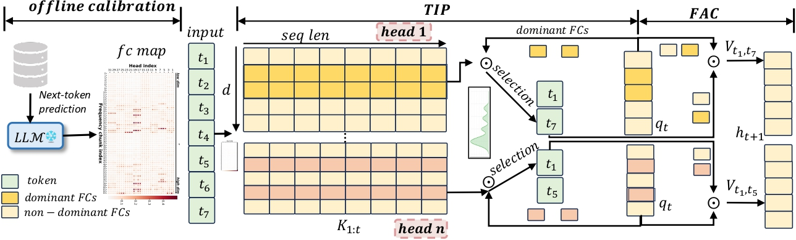

<p align="center">
    
</p>

<div align="center">

  <h1>
    FASA: FREQUENCY-AWARE SPARSE ATTENTION
  </h1>  

  <p align="center">
    <a href='https://arxiv.org/abs/2602.03152'>
      
    </a>
     &nbsp;
    <a href='https://huggingface.co/papers/2602.03152'>
      
    </a>
  </p>

  **Yifei Wang**<sup>1</sup>, 
  **Yueqi Wang**<sup>2</sup>, 
  **Zhenrui Yue**<sup>3</sup>, 
  **Huimin Zeng**<sup>3</sup>, 
  <br>
  **Yong Wang**<sup>1†</sup>, 
  **Ismini Lourentzou**<sup>3</sup>
  **Zhengzhong Tu**<sup>4</sup>
  **Xiangxiang Chu**<sup>1</sup>
  **Julian McAuley**<sup>2</sup>

  <sup>1</sup>AMAP, Alibaba Group,  &nbsp;&nbsp;
  <sup>2</sup>University of California San Diego
  <br>
  <sup>3</sup>University of Illinois Urbana-Champaign
  <sup>4</sup>Texas A&M University
  <sup>†</sup>Project leads and corresponding authors.

</div></font>

## 🔥 News
  - 🔥 **[2026.01]**: 🎉🎉🎉 Congratulations! Our paper is accepted by ICLR 2026.


## ✍️ Citation
  
  If you find this codebase useful in your research, please consider giving us a star ⭐ and citing our work 📝:
  
  ```
  @inproceedings{
    wang2026fasa,
    title={{FASA}: {FREQUENCY}-{AWARE} {SPARSE} {ATTENTION}},
    author={Yifei Wang and Yueqi Wang and Zhenrui Yue and Huimin Zeng and Yong Wang and Ismini Lourentzou and Zhengzhong Tu and Xiangxiang Chu and Julian McAuley},
    booktitle={The Fourteenth International Conference on Learning Representations},
    year={2026},
    url={https://openreview.net/forum?id=FnSgecCEwg}
    }
  ```
