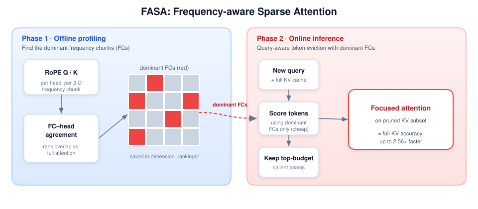
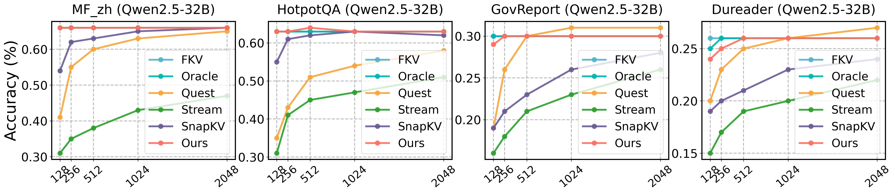
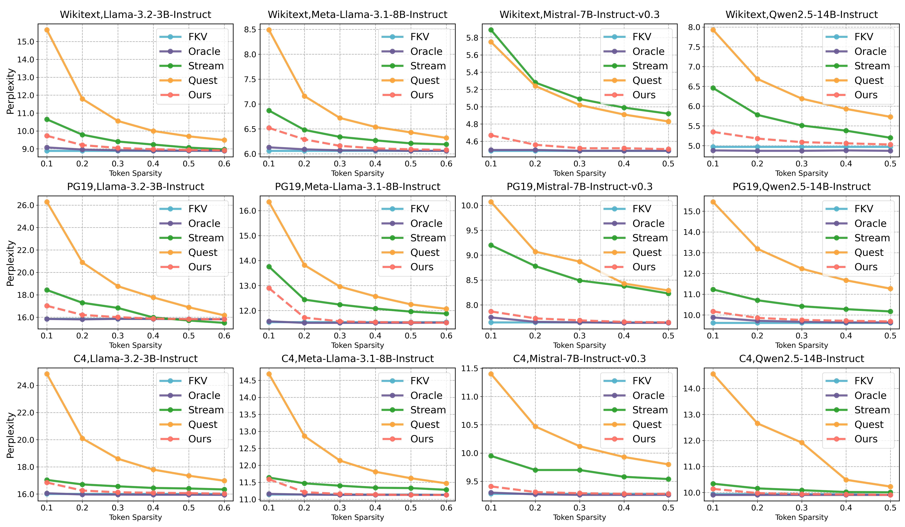

<div align="center">

# FASA: Frequency-aware Sparse Attention

**Query-aware KV-cache token eviction driven by RoPE frequency-chunk sparsity**

[](https://huggingface.co/papers/2602.03152)
[](https://arxiv.org/abs/2602.03152)
[](https://github.com/wangyifei0047/FASA-ICLR2026)
[](LICENSE)
[](https://www.python.org/)

</div>

> **TL;DR** — Long-context LLMs are bottlenecked by the KV-cache memory footprint. FASA discovers that
> a small subset of **dominant frequency chunks (FCs)** in RoPE agrees almost perfectly with the full
> attention head at ranking token importance. It uses these FCs as a *free* proxy to keep only the
> salient tokens, then attends over that pruned subset — reaching **~100% of full-KV accuracy with just
> 256 tokens** on LongBench and a **2.56× speedup using 18.9% of the cache** on AIME24.

<div align="center">
  
</div>

---

## ✨ Highlights

- 🔑 **New insight** — functional sparsity at the frequency-chunk level: a few "dominant" FCs act as a computationally-free importance proxy.
- 🎯 **Query-aware eviction** — dynamically predicts token importance instead of relying on static heuristics.
- 📈 **Near-oracle accuracy** — consistently beats H2O, Quest, SnapKV and StreamingLLM across long-context tasks.
- ⚡ **Real speedups** — up to 2.56× faster decoding at a fraction of the cache.

## 🚀 Quick start

```bash
# 1. install + point at your local HF checkpoints
pip install -r requirements.txt
export FASA_MODEL_DIR=/path/to/hf_models          # defaults to ./models

# 2. Phase 1 — find dominant FCs (once per model)
python -m identify_important_fre \
    --model_name "Meta-Llama-3.1-8B-Instruct" \
    --task_type longbench --dataset_name qasper --evaluate_num 8

# 3. Phase 2 — evaluate with FASA (LongBench shown; see below for all three)
python -m longbench.longbench_pred \
    --model_name "Meta-Llama-3.1-8B-Instruct" \
    --compression_methods dynamic_frequency --budget 256 \
    --min_k 16 --max_k 16 --threshold_ratio 0.8 --keep_high_dim 32 \
    --dataset_name narrativeqa --cal_dataset qasper --output_dir results
```

## 🧠 How it works

<table>
<tr>
<td width="50%" valign="top">

**Phase 1 · Find dominant FCs** *(offline)*

Profile how well each 2-D RoPE frequency chunk agrees with the full attention head at ranking tokens. High-agreement FCs are **dominant**. Saved to `dimension_rankings/<model>/<cal_dataset>_agreement.pkl`.

</td>
<td width="50%" valign="top">

**Phase 2 · Evict tokens** *(online)*

For each new query, score tokens using **only** the dominant FCs, keep the top-`budget` tokens, and run focused attention over the pruned KV subset — cheap, and near-lossless.

</td>
</tr>
</table>

## 📊 Results

<div align="center">

**LongBench** — accuracy vs. token budget (Qwen2.5-32B). FASA (**red**) hugs the Full-KV / Oracle curves.



**Language modeling** — perplexity vs. token sparsity across models & corpora.



</div>

**Math CoT reasoning** — accuracy at budget 1000 (calibrated on `qasper`):

| Benchmark | DeepSeek-R1-Distill-Qwen-14B | DeepSeek-R1-Distill-Qwen-32B |
|:---------:|:----------------------------:|:----------------------------:|
| AIME24    | **91.2** | **90.8** |
| MATH      | **91.0** | **90.6** |

## 🎯 Running all three benchmarks

Set `--compression_methods` / `--method` to `dynamic_frequency` (FASA) or a baseline
(`base` · `oracle` · `snapkv` · `streamingllm` · `quest`).

<details>
<summary><b>1 · LongBench</b></summary>

```bash
python -m longbench.longbench_pred --model_name "Meta-Llama-3.1-8B-Instruct" \
    --compression_methods dynamic_frequency --budget 256 \
    --min_k 16 --max_k 16 --threshold_ratio 0.8 --keep_high_dim 32 \
    --dataset_name narrativeqa --cal_dataset qasper --output_dir results
```
</details>

<details>
<summary><b>2 · Perplexity (language modeling)</b></summary>

```bash
python -m perplexity.evaluate_ppl --model_name "Llama-3.2-3B-Instruct" \
    --compression_methods dynamic_frequency --dataset_name c4 --budget 256 \
    --min_k 16 --max_k 16 --threshold_ratio 0.8 \
    --prefilling_len 8000 --decoding_len 256 --cal_dataset qasper
```
</details>

<details>
<summary><b>3 · Math CoT reasoning</b></summary>

```bash
python -m reasoning.run_math --model_name "DeepSeek-R1-Distill-Qwen-32B" \
    --dataset_name aime24 --method dynamic_frequency --budget 1500 \
    --min_k 16 --max_k 16 --threshold_ratio 0.8 --keep_high_dim 32 \
    --cal_dataset qasper --seed 1
bash reasoning/eval.sh   # grade generations
```
</details>

Ready-to-run single-GPU wrappers: `bash.sh`, `perplexity/evaluate_ppl.sh`, `reasoning/run_math.sh`, `efficiency/bench_texgen.sh`.

## ⚙️ Key arguments

| Argument | Meaning |
|----------|---------|
| `--compression_methods` / `--method` | `dynamic_frequency` (FASA) / `base` / `oracle` / `snapkv` / `streamingllm` / `quest` |
| `--budget` | KV-cache token budget (128 / 256 / 512 / 1024 …) |
| `--min_k` / `--max_k` | Min / max dominant FCs kept per head |
| `--threshold_ratio` | Quantile threshold for dominant-FC selection |
| `--keep_high_dim` | Number of high-importance dimensions kept |
| `--cal_dataset` | Calibration dataset whose Phase-1 profile is loaded |
| `--layer_control` | Restrict FASA to one layer (`-1` = all) |

## 📁 Repository layout

```
identify_important_fre.py     # Phase 1: dominant-FC profiler
monkey_patch/frequency/       # FASA (dynamic_frequency)
monkey_patch/{oracle,h2o,quest,snapkv,streamingllm}/   # baselines
longbench/ · perplexity/ · reasoning/    # the three benchmarks
efficiency/                   # latency / memory benchmarks
```

## 🔧 Installation notes

Python 3.10 with `flash-attn` matching your CUDA / torch build:

```bash
pip install torch==2.5.1 --index-url https://download.pytorch.org/whl/cu124
pip install flash_attn-2.7.4.post1+cu12torch2.5cxx11abiFALSE-cp310-cp310-linux_x86_64.whl
```

Supported models: **LLaMA / Llama-3.x**, **Qwen2.5**, **Mistral**, **DeepSeek-R1-Distill**.
LongBench / c4 / pg19 / wikitext download automatically; reasoning inputs ship under `reasoning/data/`.

## 📚 Citation

```bibtex
@article{wang2026fasa,
  title   = {FASA: Frequency-aware Sparse Attention},
  author  = {Wang, Yifei and Wang, Yueqi and Yue, Zhenrui and Zeng, Huimin and
             Wang, Yong and Lourentzou, Ismini and Tu, Zhengzhong and
             Chu, Xiangxiang and McAuley, Julian},
  journal = {arXiv preprint arXiv:2602.03152},
  year    = {2026}
}
```

## 🙏 Acknowledgements

Baseline implementations adapt the original **H2O**, **Quest**, **SnapKV**, and **StreamingLLM**
releases; the reasoning harness builds on the `latex2sympy2` math grader. Released under the
[Apache License 2.0](LICENSE).
